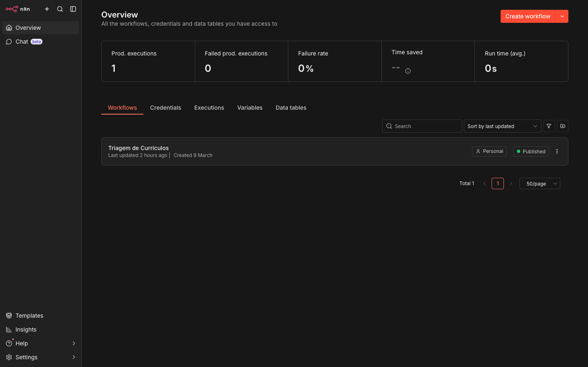
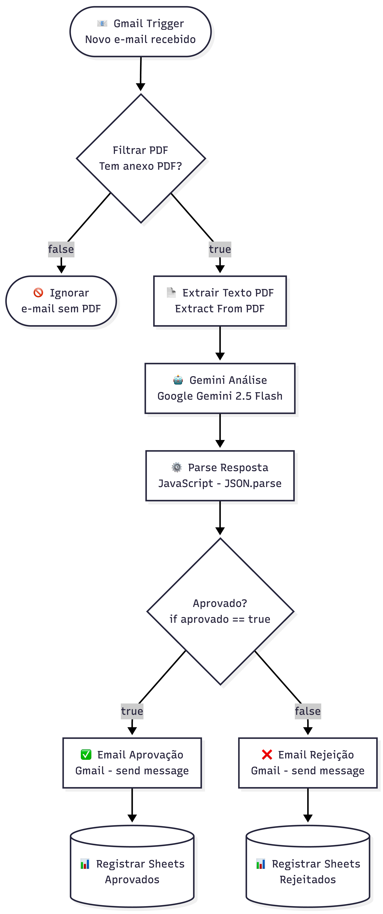
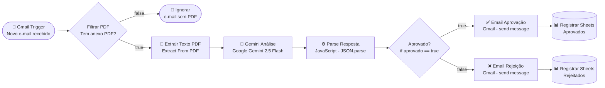
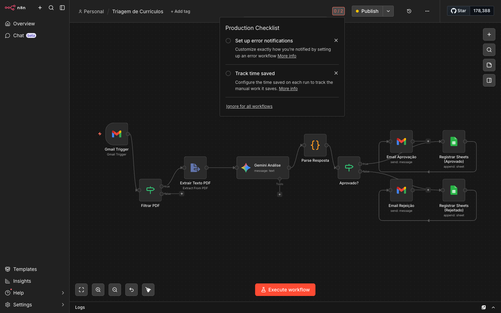
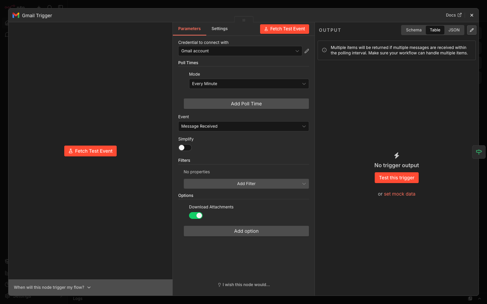
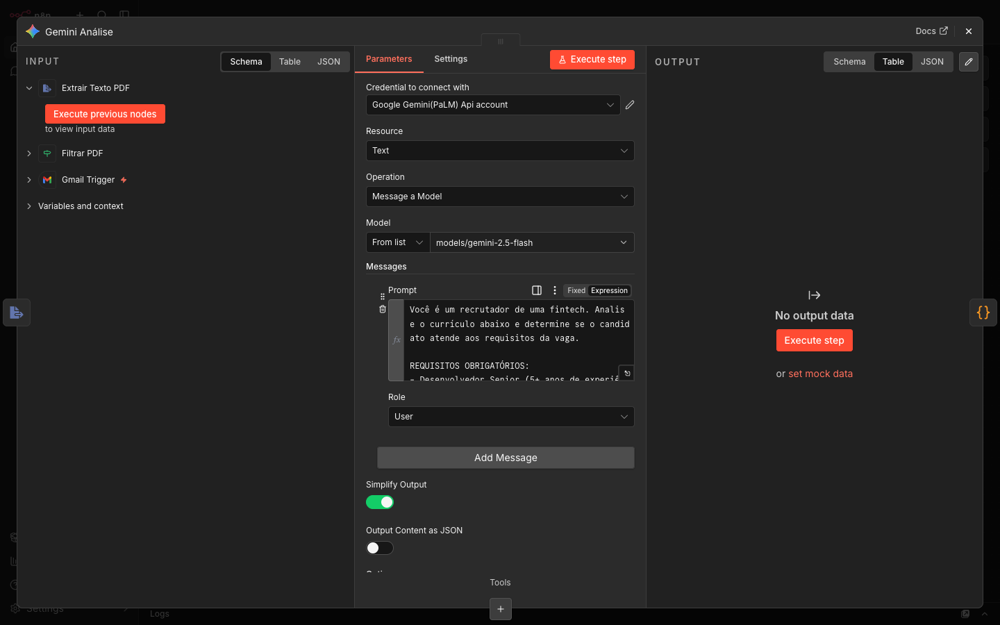
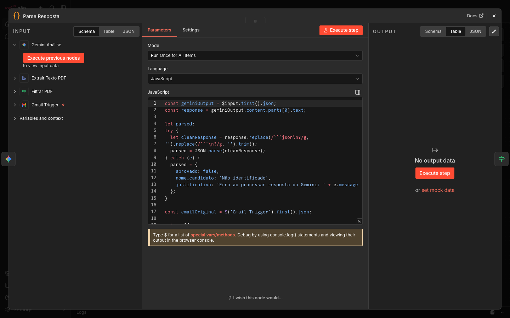
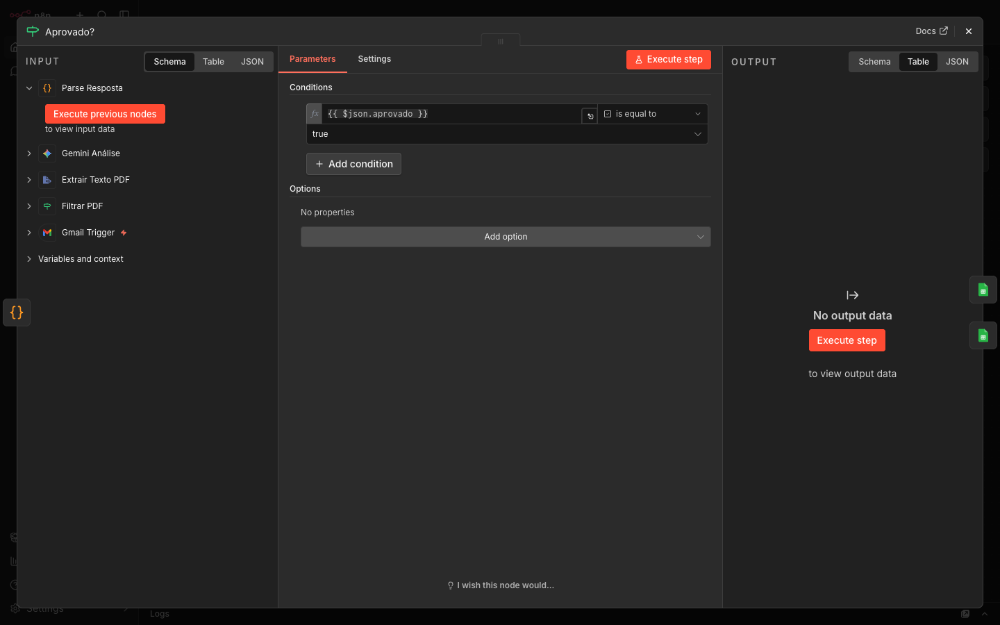
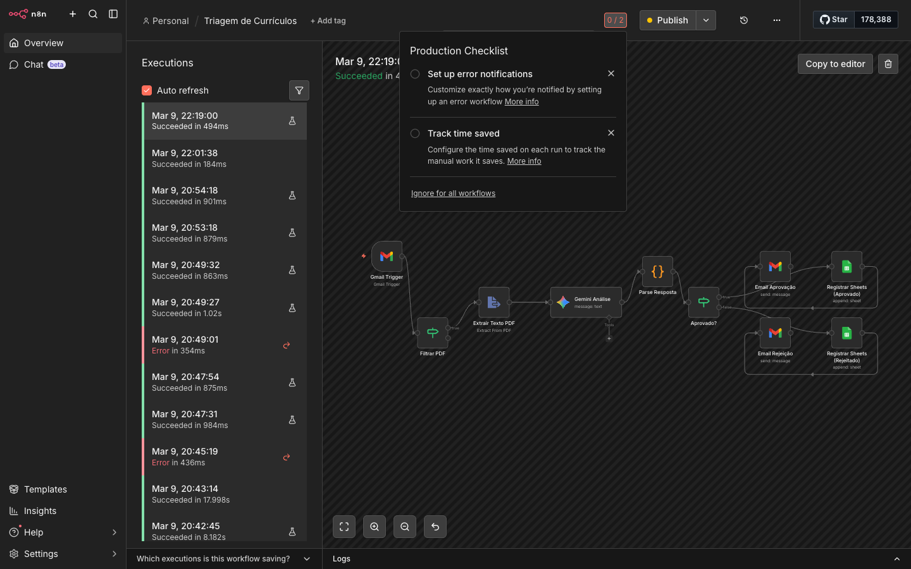

# Parte Prática: Documentação da Solução
### Disciplina: Fundamentos de IA com foco em IA Generativa

---

## 1. Visão Geral do Workflow

O workflow foi desenvolvido na plataforma **n8n** e está hospedado em um servidor VPS na nuvem, acessível em: [http://45.76.61.59:5678](http://45.76.61.59:5678)

### Captura de Tela: Visão Geral (Overview)



*Painel principal do n8n exibindo o workflow "Triagem de Currículos" publicado e ativo.*

---

## 2. Diagrama do Fluxo



<details>
<summary>Flowchart (referência em texto)</summary>



</details>

---

## 3. Canvas do Workflow



*Visão completa do workflow no editor do n8n, mostrando todos os 10 nós e suas conexões.*

O workflow é composto pelos seguintes nós:

| Nó | Tipo | Função |
|----|------|---------|
| **Gmail Trigger** | Trigger | Monitora a caixa de entrada a cada minuto por novos e-mails |
| **Filtrar PDF** | IF | Verifica se o e-mail possui anexo binário (PDF) |
| **Extrair Texto PDF** | Extract From PDF | Extrai o texto puro do arquivo PDF do currículo |
| **Gemini Análise** | Google PaLM API | Envia o texto ao modelo e recebe análise em JSON |
| **Parse Resposta** | Code (JavaScript) | Processa a resposta JSON do Gemini e estrutura os dados |
| **Aprovado?** | IF | Verifica o campo `aprovado` retornado pelo Gemini |
| **Email Aprovação** | Gmail | Envia e-mail de aprovação ao candidato |
| **Email Rejeição** | Gmail | Envia e-mail de rejeição ao candidato |
| **Registrar Sheets (Aprovado)** | Google Sheets | Registra dados do candidato aprovado na planilha |
| **Registrar Sheets (Rejeitado)** | Google Sheets | Registra dados do candidato rejeitado na planilha |

---

## 4. Configuração dos Nós Principais

### 4.1 Gmail Trigger



*Configuração do Gmail Trigger: modo de polling "Every Minute", evento "Message Received" com download de anexos ativado.*

O trigger monitora a caixa de entrada a cada minuto. A opção **Download Attachments** está ativada para que os arquivos PDF dos currículos sejam disponibilizados como dados binários para o nó seguinte.

---

### 4.2 Gemini Análise



*Configuração do nó Google Gemini: modelo `gemini-2.5-flash`, operação "Message a Model", com o prompt de triagem configurado.*

**Modelo utilizado:** `models/gemini-2.5-flash`

**Prompt completo:**

```
Você é um recrutador de uma fintech. Analise o currículo abaixo e determine
se o candidato atende aos requisitos da vaga.

REQUISITOS OBRIGATÓRIOS:
- Desenvolvedor Senior (5+ anos de experiência)
- Experiência com Node.js
- Experiência com AWS

Responda APENAS no formato JSON abaixo, sem texto adicional, sem markdown:
{
  "aprovado": true ou false,
  "nome_candidato": "nome completo extraído do currículo",
  "justificativa": "explique em 1 ou 2 frases por que foi aprovado ou rejeitado, citando os critérios"
}

CURRÍCULO:
{{ $json.text }}
```

**Decisões de design do prompt:**
- **Persona definida**: `"recrutador de uma fintech"` direciona o tom e o critério de avaliação
- **Critérios objetivos**: requisitos listados de forma clara e mensurável
- **Formato forçado**: resposta exclusivamente em JSON evita variabilidade que quebraria as etapas seguintes
- **Injeção dinâmica**: `{{ $json.text }}` é substituído pelo texto do currículo em tempo de execução

---

### 4.3 Parse Resposta



*Nó Code em JavaScript que processa a resposta do Gemini, extrai os campos e recupera o e-mail do remetente do Gmail Trigger.*

**Código JavaScript:**

```javascript
const geminiOutput = $input.first().json;
const response = geminiOutput.content.parts[0].text;

let parsed;
try {
  let cleanResponse = response
    .replace(/```json\n?/g, '')
    .replace(/```\n?/g, '')
    .trim();
  parsed = JSON.parse(cleanResponse);
} catch (e) {
  parsed = {
    aprovado: false,
    nome_candidato: 'Não identificado',
    justificativa: 'Erro ao processar resposta do Gemini: ' + e.message
  };
}

const emailOriginal = $('Gmail Trigger').first().json;

return [{
  json: {
    aprovado: parsed.aprovado,
    'Data': new Date().toISOString(),
    'Nome Candidato': parsed.nome_candidato || 'Não identificado',
    'Email': emailOriginal.from.value[0].address,
    'Status': parsed.aprovado ? 'Aprovado' : 'Rejeitado',
    'Justificativa': parsed.justificativa
  }
}];
```

Este nó realiza três funções:
1. Lê a resposta bruta do Gemini em `content.parts[0].text`
2. Remove eventuais blocos de markdown (` ```json `) e faz o `JSON.parse`
3. Recupera o e-mail do remetente diretamente do nó `Gmail Trigger` e estrutura todos os campos para as planilhas

---

### 4.4 Nó de Decisão – Aprovado?



*Nó IF que divide o fluxo: ramo `true` para candidatos aprovados, ramo `false` para rejeitados.*

O nó verifica o campo `aprovado` (booleano) retornado pelo Gemini e processado pelo Parse Resposta. Candidatos aprovados seguem para o e-mail de aprovação e a planilha de aprovados; rejeitados seguem para o e-mail de rejeição e a planilha de rejeitados.

---

## 5. Histórico de Execuções



*Aba de execuções do workflow mostrando múltiplas execuções bem-sucedidas (verde) e uma execução com erro (vermelho) referente a um e-mail recebido sem anexo PDF — tratado pelo nó Filtrar PDF nas versões posteriores.*

O histórico demonstra que o workflow processa os currículos de forma contínua e autônoma. Cada execução dura menos de 1 segundo, confirmando a eficiência do processamento automatizado.

---

## 6. Acesso ao Sistema

O workflow está publicado e em execução no seguinte endereço:

**URL:** [http://45.76.61.59:5678](http://45.76.61.59:5678)

Para instruções sobre como importar este workflow em outro ambiente n8n, consulte o arquivo [README.md](README.md).

---

*Solução desenvolvida com n8n, Google Gemini 2.5 Flash e Google Workspace (Gmail + Google Sheets).*
